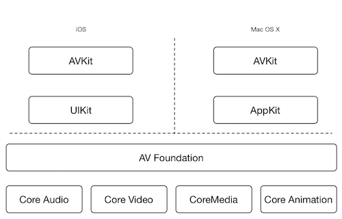

> 本系列文章仅为记录学习过程中的点滴，《AV Foundation 开发秘籍》读书笔记

## 入门

### 简介

AV Foundation是苹果OS X和iOS系统中用于处理基于时间的媒体数据的高级Objective-C的框架。利用多核硬件的优势并且大量使用block和GCD机制来保证程序的运行性能，基于64位的处理器设计。

### 支撑框架及其功能

* Core Audio

  音频事件的框架，为音频和MIDI内容的录制播放和处理提供相应的接口。通过Audio Units接口可以对音频信号进行完全的控制，同时可以构建复杂的音频处理模式。

* Core Video

  视频事件的框架，对数字视频所提供的管道模式。Core Video为其相对的Core Media提供图片缓存和缓存池的支持，其还提供了一个能够对数字视频逐帧访问的接口

* Core Media

  AV Foundation所用到的低层级媒体管道的一部分。提供针对音频样本和视频帧处理所需的低层级数据类型和接口。还提供了基于CMTime数据类型的时基模型。

* Core Animation

  合成及动画的相关框架。提供全平台所具有的美观、流畅的动画效果。

处于高层级框架(AVKit)和低层经框架(Core Audio等)之间的就是AV Foundation。

### 解析AV Foundation

AV Foundation提供的一些核心功能包括音频的播放与记录、媒体文件检查、视频播放、媒体捕捉、媒体编辑媒体处理等。既有上层可以满足一般开发者需求的API，同时还为可能有更高需求、需要定制开发的部分开发者提供低层级的服务。

### 了解数字媒体

媒体内容最初是如何被数字化的？

人们处在一个数字化的时代，却还是更习惯模拟信息的世界，人们的所见所闻（听）都是通过模拟信号船体给我们的。

将模拟信号转换成我们能够存储的的数字信号，要经过模拟-数字装换过程，这个过程就叫做`采样`。

**数字媒体采样**：媒体数字化采样主要有时间采样和空间采样。时间采样是捕捉一个信号周期内的变化。空间采样即在一定的分辨率下对某一幅画面进行亮度和色度的捕捉，进而构建成包含该图像像素点数据的数字化结果。一般当我们对一段视频进行数字化时会同时使用这两种方式，因为通常的视频信号既有时间属性也有空间属性。

### 数字媒体压缩

数字媒体压缩，无论是针对声音媒体还是视频媒体都有普遍的两张压缩方式：有损压缩、无损压缩。

视频数据采样基本都是采用YUV的颜色编码方式，其中“Y”表示**明亮度**（Luminance、Luma），“U”和“V”则是**色度**、**浓度**（Chrominance、Chroma）。

对于视频来说，常见的编解码格式可以归结为H.264和AppleProRes。

**H.264**分别通过在空间、时间两个维度进行压缩。

* 空间：压缩独立视频帧，被称为帧内压缩。
* 时间：通过以组为单位的视频帧压缩冗余数据，被称为帧间压缩。

目前已经基本成为行业内通用标准，它通过消除包含在每个独立视频帧内的色彩及结构中的冗余信息来进行压缩，因此可在不降低图片质量的情况下尽可能缩小尺寸。

在帧间压缩中，很多帧被组合在一起作为一组图片（简称GOP），对于GOP所存在的时间维度的冗余可以被消除。

其中，对于GOP，存储在其中的共有三种不同类型的帧:

* I帧：即关键帧。包含创建完整图片所需要的所有数据。每个GOP中都正好有且仅有一个I帧。由于它是一个独立的帧，其尺寸是最大的，但也是解压最快的。
* P帧：即预测帧。是从基于最近的I帧或P帧的可预测的图片进行编码得到的。P帧可以引用最近的预测P帧或一组I帧。你将会经常看到这些被称为“reference frames”的帧，临近的P帧和B帧都可以对其引用。
* B帧：双向帧。是基于其之前和之后的帧信息进行编码得到的。几乎不需要存储空间，但其解压过程会耗费较长时间，因为他的大部分信息都依赖周围其他的帧。

**Apple ProRes**被认为是一个中间件或中间层编解码器，因为他的目的是为专业编辑和生产工作流服务的。
