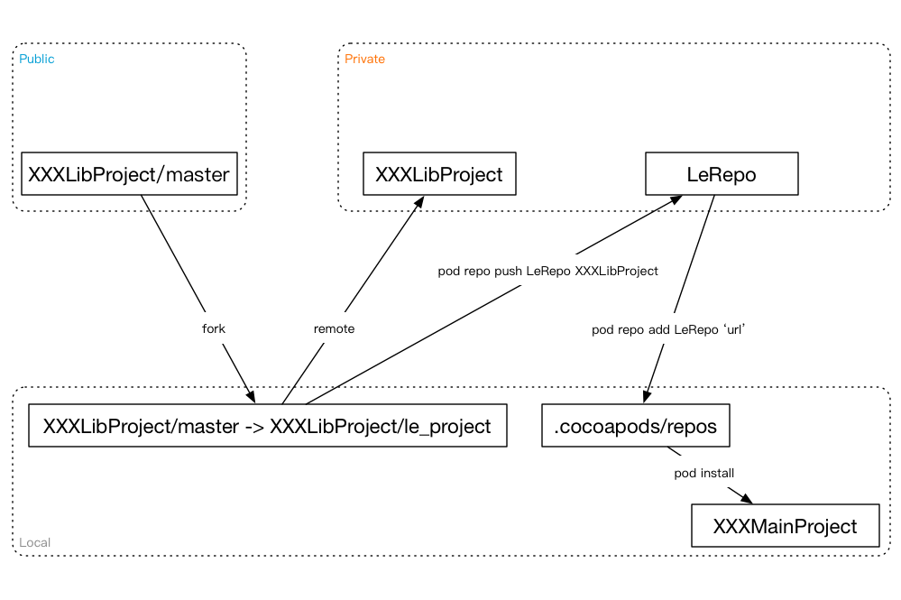
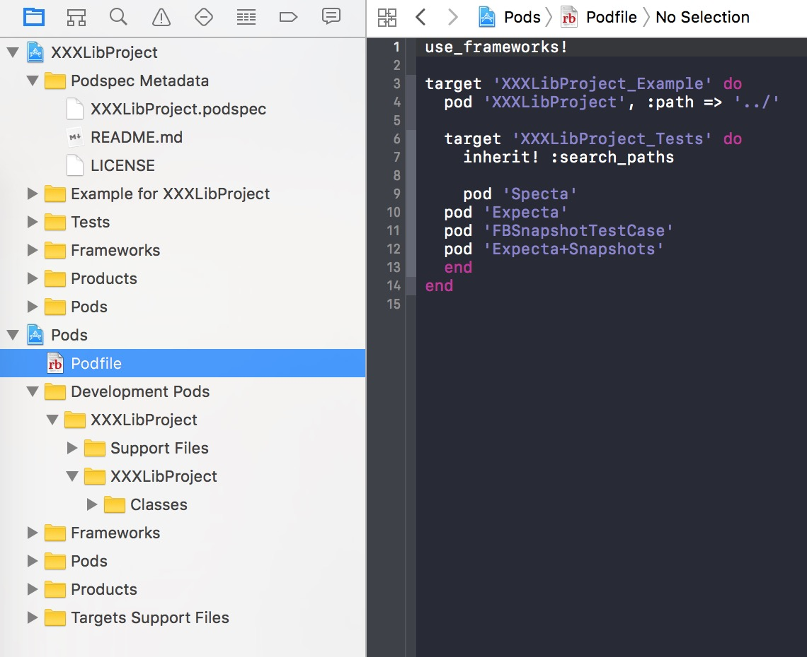
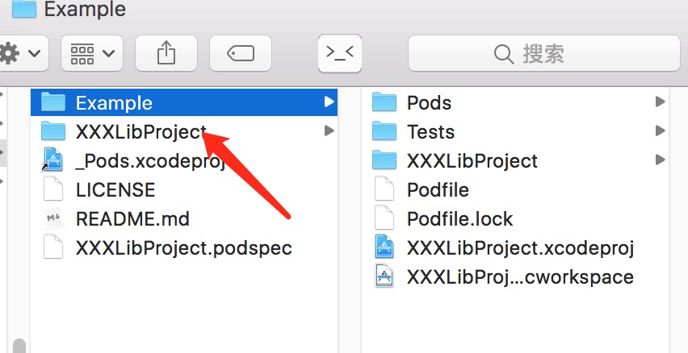
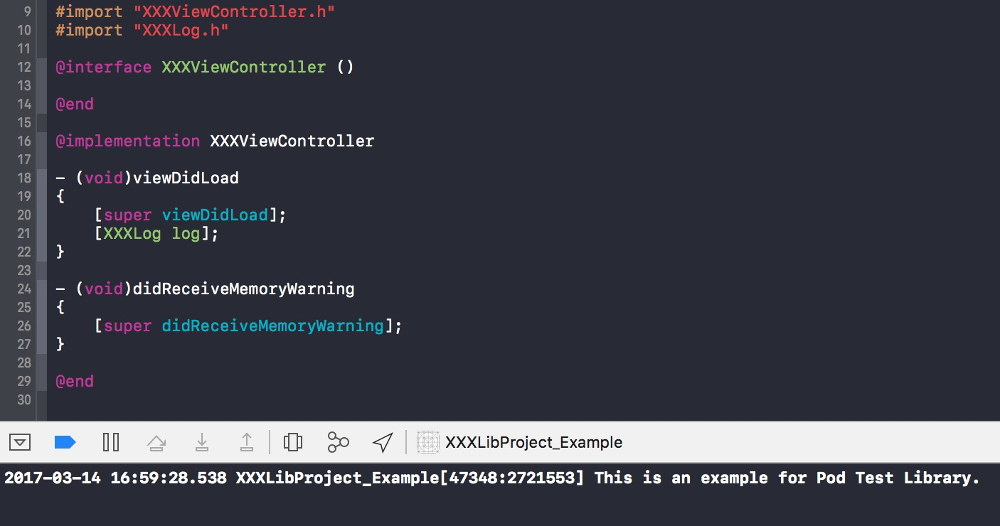

>CocoaPods作为 OS X 和 iOS 下的一个知名的第三方库管理工具早已被大家所熟知，那么在公司内部如何能够刚好的使用CocoaPods为我们的开发提供服务呢。

## 基于CocoaPods的流程简介

一般来说个公司都会有自己的git托管服务器类似gitlab。那么我认为正常的流程是这样的，如下图：



事实上，上图应该分成两个部分来看：

* 第一部分：比如说我有项目名称叫 `XXXMainProject` 需要引用一个公开仓库类似github上的一个组件，那么要做的第一步是在fork一份代码然后clone到本地，在一个你认为稳定的分支下checkout出一个新的分支例如上图，我需要使用 `XXXLibProject` ，那么我在当前master分支上checkout出一个新的分支le_project，然后把这个仓库连同新的分支推送到自己公司的私有服务器上，这样做有很多好处，比如我你可以在别人的组件库的基础上，再针对自己项目的需求进行定制，同时也可以避免其他一些不可预知的麻烦（比如说某一天这个组件库被作者删掉了 :) ，虽然这种几率几乎不可能发生，如果真的发生在你身上，那我感觉你有可能是fork了一个假项目）。

* 第二部分：我fork的这个项目已经推送到自己公司的私有服务器上了，接下来就是我要在项目中引用这个组件。首先在本地执行`pod repo add LeRepo https://gitlab.xxx.com/agenric/LeRepo.git`添加一个私有的CocoaPods仓库并命名为LeRepo，然后修改clone到本地的库的podspec文件中s.source的:git的值为私有服务器的地址。这一系列操作执行完成之后需要的就是把你开发完成之后的代码告诉你自己私有的CocoaPods仓库，`pod repo push LeRepo XXXLibProject.podspec`添加一条索引，这样之后，就可以在主项目中使用`pod 'XXXLibProject'`来加载这个组件库了。

那么，为什么要使用这种模式呢。一般情况下我们的一个项目可能会引用很多组件库，那么就需要一个私有的中心库来统一管理这些组件库。在上图中Private中的LeRepo就是我们的私有中心库，用来管理其他的组件库。

## 创建私有的远程中心库

> 注意这个远程地址是只能在公司内网环境下才能访问的地址

首先查看本地repo列表，这时候只有一个CocoaPods公开的master库

```powershell
$ pod repo list
master
- Type: git (master)
- URL:  https://github.com/CocoaPods/Specs.git
- Path: /Users/Agenric/.cocoapods/repos/master

1 repo
```

添加私有repo

```powershell
$ pod repo add LeRepo https://gitlab.xxx.com/agenric/LeRepo.git
```

之后再次查看repo的列表

```powershell
$ pod repo list
LeRepo
fatal: ambiguous argument 'HEAD': unknown revision or path not in the working tree.
Use '--' to separate paths from revisions, like this:
'git <command> [<revision>...] -- [<file>...]'
- Type: git (unknown)
- URL:  https://gitlab.xxx.com/xxx.git
- Path: /Users/Agenric/.cocoapods/repos/LeRepo

master
- Type: git (master)
- URL:  https://github.com/CocoaPods/Specs.git
- Path: /Users/Agenric/.cocoapods/repos/master

2 repos
```

因为现在的仓库还是空的，所以会提示错误，不过不用担心，稍后回来。这时候打开Finder。进入`~/.cocoapods/repos`


新创建的LeRepo已经在repos文件夹下了。

## 创建私有的组件库

接着我们来创建一个组件库在本地，组件库的创建有两种情况：

1. 组件库已将开发完毕，我们之间把代码抽取出来，放到固定位置，然后创建一个`XXXLibProject.podspec`

2. 组件库还未开发，我们可以通过`pod lib create XXXLibProject`创建，此种方式创建之后，他会从github上克隆一个模板例子，这中间会询问你一系列问题：

   ```powershell
   What language do you want to use?? [ Swift / ObjC ]
   Would you like to include a demo application with your library? [ Yes / No ]
   Which testing frameworks will you use? [ Specta / Kiwi / None ]
   Would you like to do view based testing? [ Yes / No ]
   What is your class prefix?
   ```

   中括号中的首选项为默认选项，如果你直接点击回车，则默认选中第一项。在这里语言我选择使用了oc，其余选项均为默认。

创建之后，Xcode文件结构如下图：



看到Podfile中引用XXXLibProject是通过本地path的方式引入的。也就是说在该项目下执行`pod install`之后，直接会从Podfile文件所在文件夹的上一级XXXLibProject文件夹中直接引入。

在Finder中文件结构如下：



以上箭头所指的文件夹即是pod的索引目录，这里我创建两个测试文件。

```objective-c
//  XXXLog.h
#import <Foundation/Foundation.h>

@interface XXXLog : NSObject
+ (void)log;
@end
  
  
//  XXXLog.m
#import "XXXLog.h"

@implementation XXXLog
+ (void)log {
    NSLog(@"This is an example for Pod Test Library.");
}
@end
```

然后退出在根目录执行`pod install`。打开之后可以看到XXXLibProject已经通过本地文件的方式引入进项目。在测试项目中我们已经可以开始使用这个组件。



## 发布自定义的组件库到私有的CocoaPods仓库

组件库我们开发完成之后我们要做的就是把组件库推送到私有的CocoaPods库。

打开Example文件夹中的podspec文件：

```ruby
#
# Be sure to run `pod lib lint XXXLibProject.podspec' to ensure this is a
# valid spec before submitting.
#
# Any lines starting with a # are optional, but their use is encouraged
# To learn more about a Podspec see http://guides.cocoapods.org/syntax/podspec.html
#

Pod::Spec.new do |s|
  s.name             = 'XXXLibProject'  #名称
  s.version          = '0.1.0'  #版本号
  s.summary          = 'A short description of XXXLibProject.'  #简短介绍

# This description is used to generate tags and improve search results.
#   * Think: What does it do? Why did you write it? What is the focus?
#   * Try to keep it short, snappy and to the point.
#   * Write the description between the DESC delimiters below.
#   * Finally, don't worry about the indent, CocoaPods strips it!

  s.description      = <<-DESC
            This is an example for Pod Test Library.
            This is an example for Pod Test Library.
            This is an example for Pod Test Library.
                       DESC #详细介绍

  s.homepage         = 'https://gitlab.xxx.com/agenric/XXXLibProject' #主页,这里要填写可以访问到的地址，确保验证通过
  # s.screenshots     = 'www.example.com/screenshots_1', 'www.example.com/screenshots_2'
  s.license          = { :type => 'MIT', :file => 'LICENSE' } #开源协议
  s.author           = { 'agenric' => 'AgenricWon@gmail.com' }  #作者信息
  s.source           = { :git => 'https://gitlab.xxx.com/agenric/XXXLibProject.git', :tag => s.version.to_s } #项⽬地址，这⾥不支持ssh协议，只支持HTTP和HTTPS
  # s.social_media_url = 'https://twitter.com/<TWITTER_USERNAME>' #多媒体介绍地址

  s.ios.deployment_target = '8.0' #⽀持的最低版本

  s.source_files = 'XXXLibProject/Classes/**/*'	#代码源⽂文件地址，**/*表示Classes 目录及其⼦目录下所有文件，如果有多个目录下则⽤逗号分开，如果需要在项目中分组显示，这⾥也要做相应的设置
  
  # s.resource_bundles = {
  #   'XXXLibProject' => ['XXXLibProject/Assets/*.png']	#资源⽂文件地址
  # }

  # s.public_header_files = 'Pod/Classes/**/*.h'	#公开头⽂文件地址
  # s.frameworks = 'UIKit', 'MapKit'	#所需的framework，多个⽤用逗号隔开
  # s.dependency 'AFNetworking', '~> 2.3'	#依赖关系，该项⽬目所依赖的其他库，如 果有多个需要填写多个s.dependency
end
```

以上文件中部分字段我已经标注了注释，隐私原因部分url做了修改，你也可以去[这里](http://guides.cocoapods.org/syntax/podspec.html)查看更加详细的说明。

### podspec文件验证

编辑完podspec文件之后，需要验证一下这个文件是否可用，如果有Warring或error都是不可以的。验证命令：

```powershell
$ pod lib lint

 -> XXXLibProject (0.1.0)
XXXLibProject passed validation.
```

当你看到这个提示时，说明这个podspec文件是合格的，验证通过了。

### 向Spec Repo提交podspec

当确定组件库没有问题时，我们就可以把podspec提交给自己的私有repo的远程库了。

但是在这之前我们要先把组件库的代码提交到git上，然后打上tag，推送到git服务器上。这样是为了让repo仓库在检索的时候能够找到组件库所在的位置。

```powershell
$ pod repo push LeRepo XXXLibProject.podspec

Validating spec
 -> XXXLibProject (0.1.0)

Updating the `LeRepo' repo

Your configuration specifies to merge with the ref 'master'
from the remote, but no such ref was fetched.

Adding the spec to the `LeRepo' repo

 - [Add] XXXLibProject (0.1.0)

Pushing the `LeRepo' repo

Username for 'https://gitlab.xxx.com': agenric
Password for 'https://gitlab.xxx.com':
To https://gitlab.xxx.com/agenric/LeRepo.git
 * [new branch]      master -> master
```

完成之后这个组件库就添加到了我们私有的repo库（LeRepo）中了，可以进入到`~/.cocoapods/repos/LeRepo` 目录下进行查看。

到此之后你就可以在你的XXXMainProject中引入这个组件库了，需要注意的是你要在XXXMainProject项目的Podfile文件头部加入以下两行代码，以确保你在执行pod命令时，pod可以检索的你的私有中心库中的组件库。

```powershell
source 'https://github.com/CocoaPods/Specs.git'
source 'https://gitlab.xxx.com/agenric/LeRepo.git'
```

> 注：鉴于隐私性文中的部分内容使用xxx代替，例如`gitlab.xxx.com`。所以你可能并不能直接拷贝使用，本文旨在描述基于CocoaPods开发的一系列流程。如有问题，欢迎留言探讨。

---

### 补充：

额外补充一点，这也是我在使用过程中发现的一些小tips。

相对于发布私有的lib来说，发布公开的lib会简单的多，因为不用有那么多的配置，但是需要注册一个trunk，因为我们需要使用trunk来想公共的CocoaPods库来发布我们想要公开的lib。

**注册**

```powershell
$ pod trunk register eloy@email.com 'my name'    #注册，会发带验证链接的邮件到邮箱地址，名称无法修改
$ pod trunk me    #注册完成后，可通过该语句查询注册信息。
```

#### 发布过程中，podspec验证可能会遇到一些错误

**1.语法错误：**

这种错误一般会给出准确的错误提示，在文件错误的位置下方会有^提示，所以注意中英文的引号之类的问题。

**2.依赖错误：**

举个例子比如说你的lib库可能依赖一些.a的静态库（比如：WeiboSDK，WeChatSDK）,类似下面这样：

```powershell
- ERROR | [iOS] unknown: Encountered an unknown error (The 'Pods-App' target has transitive dependencies that include static binaries: ( /private/var/folders/c1/fkcs97852_5bbsxc7_xj_6lm0000gn/T/CocoaPods/Lint/Pods/WechatOpenSDK/OpenSDK1.7.7/libWeChatSDK.a, and /private/var/folders/c1/fkcs97852_5bbsxc7_xj_6lm0000gn/T/CocoaPods/Lint/Pods/WeiboSDK/libWeiboSDK/libWeiboSDK.a)) during validation.
```

事实上，这种错误并不影响Pod的使用，但是无法验证通过。这时候你可以通过 --use-libraries 来让验证通过。

`pod spec lint xxx.podspec --verbose --use-libraries`

有时你即使使用了 --use-libraries 来忽略错误，也不见得会验证通过，因为这样的话有可能会带来一些警告，这时你可以使用 --allow-warnings 来允许忽略警告。

`pod spec lint xxx.podspec --verbose --use-libraries --allow-warnings`

如果你使用了这种方式验证通过，那么当你发布的时候，你需要加上同样的参数来保证发布成功。

to be continue...
