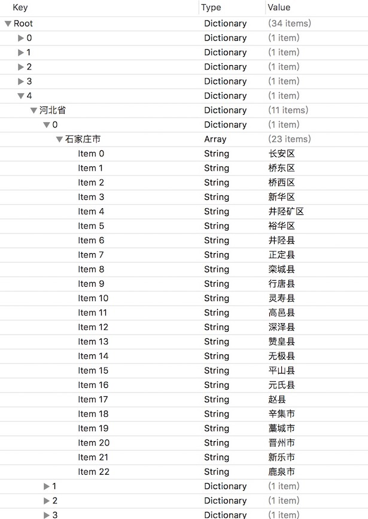

前两天收到一个朋友的飞鸽求助，其实也说不上是求助了，就是朋友之间的友好交流。

传来一个文件，名称`area.plist`。打开看了之后我就懂了，事实上我感觉这玩意网上应该多了去了，但是，自己写一下应该也蛮有意思。

OK，先来看一下数据结构，因为我最开始就是因为没有充分研读数据文件，造成中间绊了很多没必要的坎。



这样解释，一级根字典共包含34个元素（即23个省、4个直辖市、5个自治区、2个特别行政区），其中每个元素又是一个字典，并且是一个有且仅有一个键值对的字典。这唯一的键即是该省的名称。例：上图中第五个元素中，字典的value就是河北省的数据结构。

接下来是二级子元素，二级字典有且仅有一个三级元素，该三级元素为字典类型。

三级元素开始从省份下细分市级元素，每个市级元素还是一个字典，并且依然是一个有且仅有一个键值对的字典。这唯一的键即是该市的名称。例：上图中河北省下共设11个市，这11个子元素中，每个value就代表一个市的数据结构。

接下来是第四级元素，四级元素有且仅有一个五级元素，该五级元素为数组类型。

五级元素开始从市下细分区、县级元素，每个区、县级元素就是数组中的一个简单的字符串元素，该字符串即是该区、县的名称。例：上图中河北省石家庄市共设23个区、县。

此处应该有个黑线脸...... 不知道你们看的拗不拗眼，反正我说的是挺拗口的。对，刚开始我不太理解为什么会是这么复杂的结构，比如说国家下一级为什么不直接用省的名字作为key来存储，而非要再给每个省都额外再包装一个字典，省元素的下一级为什么不直接用市的名字为key来存储，而非要给每个市都再额外包装一个字典。就像下面这样：

```json
{
  "北京市":{
    "北京市":[
      "东城区",
      "西城区",
      "朝阳区",
      ...
    ]
  },
  "河北省":{
    "石家庄市":[
      "长安区",
      "桥东区",
      "桥西区",
      ...
    ],
    "唐山市":[
      ...
    ],
  },
  ...
}
```

难道不好么… 呵呵呵，如果你跟我一样这样想，那我告诉你：Too Young Too Simple。

因为是这样，Foundation框架中的NSDictionary。它有一个只读属性allKeys。如果按照我们以上这个字典的设计形式，我想要通过allKeys获取全国所有的省份，拿到结果后你会发现，Oh NO。这顺序，不忍直视对吗，并且每次调用这个方法的返回顺序可能都不尽相同，这就是iOS中字典这个数据结构的特性，他并没有对自己的元素进行有效的排序，不像数组那样，第一个add进去的就肯定是数组的第0号元素。

所以现在我们明白，为什么每个子列表下的元素都要通过外边再包一层index的手段来确保能够手动的实现子列表下元素的有序排列。

然后，接下来Coding：

首先，自定义的PickerView实现`UIPickerViewDataSource`、`UIPickerViewDelegate`。

DataSource需要返回该picker共有几个组，每个分组下有多少行。

```objc
- (NSInteger)pickerView:(UIPickerView *)pickerView numberOfRowsInComponent:(NSInteger)component {
    if (component == 0) { // 第一组
        return [self.totalDatas count];
    } else if (component == 1) { // 第二组
        // 省级父类的字典
        NSDictionary *provinceFather = [self.totalDatas valueForKey:[NSString stringWithFormat:@"%ld",(long)[pickerView selectedRowInComponent:0]]];
        // 省字典
        NSDictionary *provinceDictionary = [provinceFather valueForKey:[[provinceFather allKeys] firstObject]];
        return [provinceDictionary count];
    } else { // 第三组
        // 省级父类的字典
        NSDictionary *provinceFather = [self.totalDatas valueForKey:[NSString stringWithFormat:@"%ld",(long)[pickerView selectedRowInComponent:0]]];
        // 省字典
        NSDictionary *provinceDictionary = [provinceFather valueForKey:[[provinceFather allKeys] firstObject]];
        // 市字典
        NSDictionary *cityDictionary = [provinceDictionary valueForKey:[NSString stringWithFormat:@"%ld",(long)[pickerView selectedRowInComponent:1]]];
        // 区数组
        NSArray *districtArray = [cityDictionary valueForKey:[[cityDictionary allKeys] firstObject]];
        return [districtArray count];
    }
}
```

Delegate一共提供了三种方法供我们自定义每一个item的显示。分别是返回一个NSString、NSAttributedString、UIView。因为地区的选择无非就是固定item返回对应的字符串，但是有个问题就是要考虑字体的显示是否可以显示完整之类的，所以我们最好选择返回NSAttributedString或自定义UIView这种方式，可定制化更高。这里我选择了使用UIView（UILabel）：

```objc
- (UIView *)pickerView:(UIPickerView *)pickerView viewForRow:(NSInteger)row forComponent:(NSInteger)component reusingView:(nullable UIView *)view {
    UILabel *desLabel = [[UILabel alloc] initWithFrame:CGRectMake(0, 0, SCREEN_WIDTH / 3.0f, 30)];
    [desLabel setBackgroundColor:[UIColor clearColor]];
    [desLabel setTextAlignment:NSTextAlignmentCenter];
    [desLabel setFont:[UIFont systemFontOfSize:14]];

    // 省级父类的字典
    NSDictionary *provinceFather = [self.totalDatas valueForKey:[NSString stringWithFormat:@"%ld",(long)[pickerView selectedRowInComponent:0]]];
    // 省字典
    NSDictionary *provinceDictionary = [provinceFather valueForKey:[[provinceFather allKeys] firstObject]];
    // 市字典
    NSDictionary *cityDictionary = [provinceDictionary valueForKey:[NSString stringWithFormat:@"%ld",(long)[pickerView selectedRowInComponent:1]]];
    // 区数组
    NSArray *districtArray = [cityDictionary valueForKey:[[cityDictionary allKeys] firstObject]];

    if (component == 0) { // 第一组
        [desLabel setText:[[[self.totalDatas valueForKey:[NSString stringWithFormat:@"%ld", (long)row]] allKeys] firstObject]];
        return desLabel;
    } else if (component == 1) { // 第二组
        [desLabel setText:[[[provinceDictionary valueForKey:[NSString stringWithFormat:@"%ld", (long)row]] allKeys] firstObject]];
        return desLabel;
    } else { // 第三组
        if (districtArray.count <= row) {
            return nil;
        }
        [desLabel setText:districtArray[row]];
        return desLabel;
    }
}
```

以上self.totalDatas即是地区plist文件读取出来的字典。

需要注意的就是：

**首先**：一定要理清这个字典内部详细的数据结果，这样我们才能清晰的知道，什么时候需要使用allKeys，什么时候需要firstObject，什么时候需要valueForKey。

**其次**：要实现Delegate中的`-(void)pickerView:(UIPickerView *)pickerView didSelectRow:(NSInteger)row inComponent:(NSInteger)component`方法，确保在每一个单元格的值改变后更新它的联动数据，如果省份数据发生变化需要更新市的数据和区、县的数据，如果市的数据发生了变化则只需要更新区、县的数据。

**最后**：在用户选择完成后，我们可以选择代理或者block的方式将结果传递回去。这里根据当前picker每一列的行数，获取该行对应的名称即可。同样还是，注意数据结构，要明白我们每一步的操作取出的到底是字典数据还是数组数据，这至关重要，代码在下面：

```objc
/* 省 */
NSInteger provinceIndex = [self.myPickerView selectedRowInComponent:0];
/* 市 */
NSInteger cityIndex = [self.myPickerView selectedRowInComponent:1];
/* 区 */
NSInteger districtIndex = [self.myPickerView selectedRowInComponent:2];

// 省级父类的字典
NSDictionary *provinceFather = [self.totalDatas valueForKey:[NSString stringWithFormat:@"%ld",(long)provinceIndex]];
// 省的名字
NSString *selectedProvinceName = [[provinceFather allKeys] firstObject];
// 省字典
NSDictionary *provinceDictionary = [provinceFather valueForKey:selectedProvinceName];
// 市字典
NSDictionary *cityDictionary = [provinceDictionary valueForKey:[NSString stringWithFormat:@"%ld",(long)cityIndex]];
// 市的名字
NSString *selectedCityName = [[cityDictionary allKeys] firstObject];
// 区数组
NSArray *districtArray = [cityDictionary valueForKey:selectedCityName];
// 区名字
NSString *selectedDistrictName = districtArray[districtIndex];
```

### 瑕疵

看图就懂：


我们会发现，有些地方的名字为啥辣么长...

我在想他们参加工作入职填表的时候，家庭住址那一栏，要折几行才能写完。哈哈哈...玩笑了，证明除了逻辑整明白之后，一定要充分考虑UI显示，比如说到底是用NSAttributedString还是自定义UIView，每个item的宽度如何分配，不过这些东西我们就不在这里赘述了...

最后，还有一点，当我写完文章的时候我忽然又想起这个数据结构，为什么我们一开始不直接从这个数据结构来入手呢？比如说，这样：

```json
[
  {
    "北京":[
      {"北京市":["朝阳区","东城区","海淀区"]}
    ]},
  {
    "河南省":[
      {"郑州市":["中原区","二七区","金水区"]},
      {"洛阳市":["老城区","西工区"]},
      {"许昌市":["魏都区","许昌县","鄢陵县"]}
  ]},
]
```

会不会就解决了我们之前每个字典都要再包一层index的问题呢，留给各位一试。

如果你想看一下代码，去[这里](https://github.com/Agenric/AreaPicker)。
