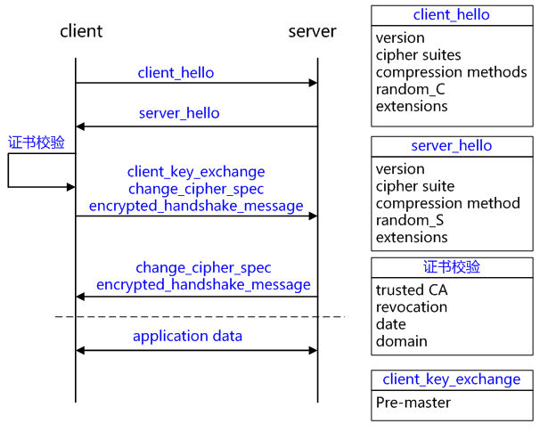
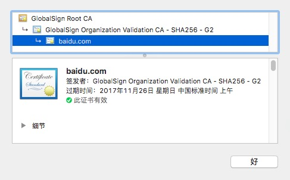

早在去年（2016）年底，关于`Apple要求所有的开发者在2017-01-01之前务必将App Store上的APP适配HTTPS`。然而...

结果大家现在都知道了呗，而且当时论坛有同学贴出针对此事咨询Apple的回复邮件，邮件中告知并没有...

But，不管怎样，是时候给你的APP穿上一层保护衣了。

关于如何适配HTTPS，许多前辈都已经讲的非常好了，本人文笔拙劣，就不再赘述。

然后我想说的是关于HTTPS证书的验证。

先来看一下客户端与服务器进行HTTPS连接的握手过程：（图片来自[网络](http://www.wosign.com/faq/faq2016-0309-04.htm)）



第三步，证书校验。客户端验证证书的合法性，如果验证通过之后才会进行后续通信。

如果我们用的是权威机构颁发的证书，那么之前很可能这样做：

```objc
AFHTTPSessionManager *manager = [[AFHTTPSessionManager alloc] init];
manager.securityPolicy = [AFSecurityPolicy defaultPolicy];
```

然而，这根本抵挡不了代理工具的查（gong）看（ji）。

使用Charles配置SSL Proxy Setting添加对应的域名，客户端安装一个Charles颁发的根证书并且信任之后，这两句话就形同虚设了，这种操作对应稍微有点经验的软件从业者来说根本不是什么难事。

因为证书校验过程中，客户端会检查服务端发来的证书是不是可信任机构颁发的、证书中的域名与实际域名是否一致、证书是否已经过期之类的，而因为你提前已经安装并且信任了Charles给你的根证书，所以这时候你再拿着Charles给你的证书去做匹配，那么系统本地当然会告诉你这个证书是可信任的。

如何避免这种情况呢，这就说到了本地的证书校验，我们可以直接把CA给你签发的数字证书内置到手机中，并且作为信任的证书，这样当我们再次收到服务端（实际上是Charles）返回给我们证书时，我们会这样做：

```objective-c
AFHTTPSessionManager *manager = [[AFHTTPSessionManager alloc] init];
NSString *cerPath = [[NSBundle mainBundle] pathForResource:@"key" ofType:@"cer"];//证书的路径
NSData *cerData = [NSData dataWithContentsOfFile:cerPath];
AFSecurityPolicy *securityPolicy = [AFSecurityPolicy policyWithPinningMode:AFSSLPinningModeCertificate];
securityPolicy.allowInvalidCertificates = NO; // 是否需要验证自建证书
securityPolicy.validatesDomainName = NO; // 是否需要验证域名
securityPolicy.pinnedCertificates = [NSSet setWithObject:cerData];
manager.securityPolicy = securityPolicy;
```

完了之后，我们的APP就会发现，这不是我们服务器的证书，这丫会不会是个骗子，从而终止连接。

这样的话，新的问题又来了，如果我们使用的是权威机构颁发的证书，这个证书肯定是有有效期的，普通公司的证书一般有效期都是1年，逐年更新，那么一旦证书失效，这个验证就会失败，这样直接造成我们的APP不能用了，虽然我们可以通过提前更换新版本强制更新来解决，但这毕竟是非正常手段。我们总不能因为这个问题每年来一次强制更新吧，当然如果产品和市场抛开用户体验不谈的话就当我没说。

当然，你如果用的是自签名的证书，就可以轻而易举的解决这个问题，比如说你给自己签一个有效期50年的证书，50年来一次大改版强制更新不足为奇吧，并且重要的是50年后即便出了问题也不是我们的锅了，天知道那时候你是不是回家养老了，哈哈，扯远了，拉回来......

然而，并不是每个人都喜欢用自签名的证书，毕竟这样的证书如果你在浏览器打开，就会有一个红叉叉告诉你这个网站不安全。我司老板就是这样的人，所以我们的证书是权威机构购买的，而且老板大手一挥就是一个通配符的。（并没有炫耀的嫌疑）

事实上还有另外一种方法，而且我司现在用的也正是这种方法，当然需要一个前提就是，假如你的证书快要到期，需要续期的时候，买的还是同一家的同一款产品才行。

其实我们可以看到，`AFSSLPinningMode`有三个可选项，分别是：

* `AFSSLPinningModeNone`：代表客户端无条件信任服务器端返回的证书。
* `AFSSLPinningModePublicKey`：代表客户端仅对证书进行PublicKey部分的验证，只要PublicKey部分校验正确，就会继续执行。
* `AFSSLPinningModeCertificate`：代表客户端会对证书所有内容，包括PublicKey和证书部分都进行校验，如果校验正确，就会继续执行。

对，我们选择，AFSSLPinningModePublicKey这种模式，然后需要把给我们签发证书的机构的证书打包进APP里。

上一张图，以Baidu.com的证书为例子：



我们看到baidu的证书是从一家名叫GlobalSign的SSL证书签发商签发的，一般来说，现在大多数的CA并不使用根证书直接签署证书，而是签署中间CA，由中间的CA来再次签署服务器证书，这样即使根证书出现了某些问题，也可以用根证书重新签署中间证书。

那么实际上，在HTTPS握手开始后，服务端会把整个证书链给到客户端去做校验。校验的过程就是要找到是否存在这样一条证书链，链中的每个相邻节点，上级的公钥可以校验通过下级的证书，链的根节点是设备信任的锚点或者根节点可以被锚点校验，事实上锚点对应浏览器来说就是内置的根证书。

这样的话如果我们把给我们签署服务端证书的父级证书（即CA机构的中间证书）放在客户端本地作为我们验证的锚点，对比上图中的GlobalSign Organization Validation CA - SHA256 - G2。这样之后不仅可以预防代理人的中间攻击，还不用担心日后证书过期更换证书带来的麻烦。

这样仔细想一下，未尝不是一个好的解决方案。只要遵守上文中我说的那个前提，还是从同一家的同一个中间CA签发的证书，就一切OK。
